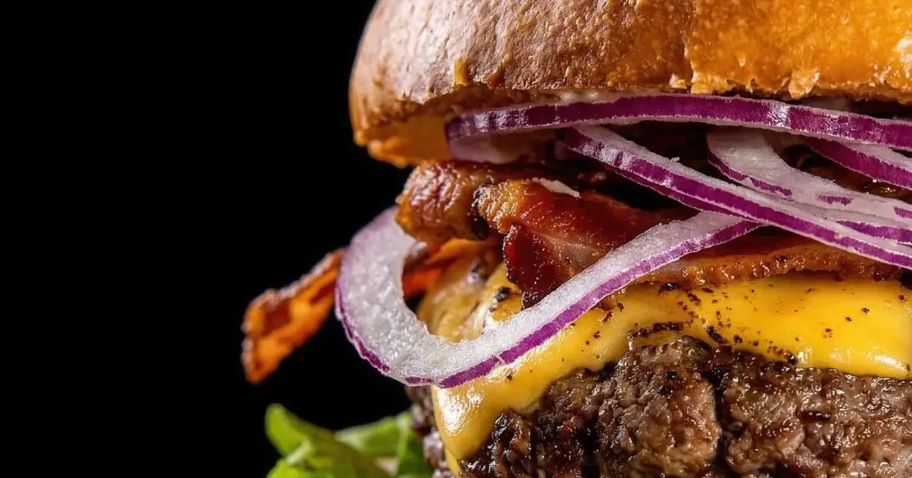

<div align="center">

# Boi na Brasa Burguer

### Site institucional responsivo para uma hamburgueria artesanal em Piracaia/SP

[](https://boinabrasaburguer.com.br/)
[](#)
[](#)
[](https://www.cloudflare.com/)

**[Acessar o projeto online](https://boinabrasaburguer.com.br/)**

</div>

---

## Sobre o projeto

O **Boi na Brasa Burguer** é um projeto web desenvolvido para fortalecer a presença digital da hamburgueria, apresentar sua identidade e facilitar o acesso dos clientes aos produtos, cardápio e principais canais de contato.

A interface foi construída com foco em **responsividade, navegação simples, identidade visual e experiência mobile**, considerando o uso predominante de smartphones por clientes de negócios locais.

<p align="center">
  
</p>

---

## Objetivos

- Criar uma presença digital própria para o estabelecimento.
- Apresentar a marca e os produtos de forma clara e visual.
- Facilitar o acesso ao cardápio e aos canais comerciais.
- Garantir boa experiência em celulares, tablets e desktops.
- Aplicar boas práticas de SEO técnico e compartilhamento social.
- Publicar o projeto em domínio próprio com HTTPS.

---

## Principais recursos

- Layout responsivo.
- Hero visual com identidade da marca.
- Apresentação dos produtos e diferenciais do estabelecimento.
- Integração com cardápio online e canais externos.
- Metadados Open Graph e Twitter Card.
- Dados estruturados com Schema.org para negócio local/restaurante.
- Sitemap e `robots.txt`.
- Assets otimizados em WebP.
- Domínio personalizado e publicação em produção.

---

## Tecnologias e conceitos aplicados

- **React**
- **HTML5**
- **CSS3**
- **JavaScript**
- **Responsive Web Design**
- **SEO técnico**
- **Schema.org / JSON-LD**
- **Open Graph**
- **Cloudflare**
- **DNS e HTTPS**
- **Git / GitHub**

---

## Estrutura desta versão

```text
Boi-Na-Brasa-Burguer/
├── assets/          # JavaScript e CSS do build
├── brand/           # Identidade visual e logos
├── media/           # Imagens e vídeo utilizados no site
├── favicon.svg
├── index.html
├── robots.txt
├── sitemap.xml
└── README.md
```

> Este repositório contém a versão de produção publicada do projeto, preparada para entrega e deploy estático.

---

## SEO e presença digital

O projeto inclui elementos voltados à indexação e apresentação correta em mecanismos de busca e redes sociais, como:

- `title` e meta description;
- URL canônica;
- Open Graph;
- Twitter Card;
- `sitemap.xml`;
- `robots.txt`;
- dados estruturados em JSON-LD;
- informações do estabelecimento e cardápio.

---

## Deploy

A versão em produção está disponível em:

**https://boinabrasaburguer.com.br/**

A publicação utiliza infraestrutura da **Cloudflare**, com domínio personalizado e HTTPS.

---

## Status

**Em produção.**

O projeto pode receber novas atualizações de conteúdo, interface e otimização conforme as necessidades do estabelecimento.

---

## Autor

**Joao Paulo Alves**  
Desenvolvedor formado em **Análise e Desenvolvimento de Sistemas**.

[](https://github.com/MrJohnPaul89)
[](https://www.linkedin.com/in/jpalves89/)
[](https://www.instagram.com/devfs_mrjp89/)

---

<div align="center">

**Boi na Brasa Burguer**  
Desenvolvimento web aplicado a uma necessidade comercial real.

</div>
